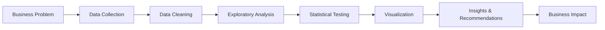

<div align="center">

# 👋 Hi, I'm Deepak Kumar

### 📊 Data Analyst | Python Enthusiast | Turning Data into Insights

[](https://www.linkedin.com/in/deepak-kumar-0c/)
[](https://bit.ly/deepak-portfolio-111)
[](https://twitter.com/Deepakk38716401)
[](mailto:deepakthedev@gmail.com)

  🎓 BSC Information Technology Student 

</div>

---

## 🎯 About Me


**🔥 What I Do:**
- 📈 Transform raw data into actionable business insights
- 💡 Build data-driven solutions to real-world problems
- 📊 Create compelling visualizations that tell stories
- 🎯 Bridge the gap between data and decision-making

---

## 🛠️ Technical Skills

### **Programming & Analysis**


### **Data Visualization**


### **Tools & Technologies**


### **Core Competencies**
```
📊 Exploratory Data Analysis (EDA)     🧮 Statistical Analysis & Hypothesis Testing
📈 Data Visualization & Storytelling   🧹 Data Cleaning & Preprocessing
💹 Financial Analytics                 🤖 Machine Learning Basics
📉 Business Intelligence               🔍 SQL Query Optimization
💼 A/B Testing & Experimentation      📊 Dashboard Development
```

---

## 🚀 Featured Projects

### 📊 [Amazon Electronics Sales Analysis](https://github.com/deepak338/Amazon_sales_analysis)


**Comprehensive e-commerce data analysis revealing pricing strategies and quality insights**

- 📦 Analyzed **1,463 products** across 21 categories with 99.99% data completeness
- 💰 Identified optimal discount range (**40-60%**) maximizing engagement
- 🎯 Discovered sweet spot pricing (**₹500-2K**) achieving 4.12 avg rating
- ⚠️ Flagged **12 critical quality** issues and 156 poor-value products
- 📈 Created **24 professional visualizations** with actionable recommendations
- 💼 **Expected Impact:** 15-20% revenue increase

**Tech Stack:** `Python` `Pandas` `Seaborn` `Matplotlib` `Statistical Analysis` `EDA`

**Key Skills:** Data Cleaning • Exploratory Analysis • Visualization • Business Insights

<br clear="right"/>

---

### 💹 [Portfolio Optimization System](https://github.com/deepak338/portfolio_opt)


**Quantitative finance project implementing Modern Portfolio Theory for optimal asset allocation**

- 📊 Analyzed **5 years** of historical data across 5 ETFs (SPY, BND, GLD, QQQ, VTI)
- ⚖️ Implemented efficient frontier with Monte Carlo simulation
- 🎯 Optimized portfolio: **50% GLD + 50% QQQ** (Sharpe ratio: 0.75)
- 📉 Achieved **15-20% risk reduction** through correlation analysis
- 📈 Generated interactive visualizations and performance metrics
- 💡 Demonstrated diversification benefits of low-correlation assets

**Tech Stack:** `Python` `SciPy` `NumPy` `Pandas` `yfinance` `Matplotlib`

**Key Skills:** Financial Modeling • Optimization • Risk Analysis • Statistical Computing

<br clear="right"/>

---

## 📊 GitHub Statistics

<div align="center">
  


</div>

<div align="center">
  
[](https://git.io/streak-stats)

</div>

---

## 💼 What I'm Currently Working On

```python
current_goals = {
    "📚 Learning": [
        "Advanced SQL window functions and CTEs",
        "Machine Learning algorithms (regression, classification)",
        "Time series analysis and forecasting",
        "A/B testing and experimentation frameworks"
    ],
    
    "🔨 Building": [
        "Interactive dashboards with Streamlit/Plotly Dash",
        "End-to-end data pipeline projects",
        "Customer segmentation analysis",
        "Predictive modeling projects"
    ],
    
    "🎯 Goals": [
        "Land first data analyst role",
        "Contribute to open-source data science projects",
        "Build 5+ portfolio projects by Q1 2025",
        "Master Tableau & Power BI for BI analytics"
    ],
    
    "📖 Studying": [
        "Statistics fundamentals",
        "SQL for data analysis (Leetcode SQL problems)",
        "Data storytelling techniques",
        "Business intelligence best practices"
    ]
}
```

---

## 📈 My Data Analysis Approach



**My Process:**
1. 🎯 **Understand the Business Context** - Ask the right questions
2. 🔍 **Data Collection & Assessment** - Gather and evaluate data quality
3. 🧹 **Data Cleaning** - Handle missing values, outliers, and inconsistencies
4. 📊 **Exploratory Data Analysis** - Discover patterns and relationships
5. 🧮 **Statistical Analysis** - Test hypotheses and validate findings
6. 📈 **Visualization** - Create compelling charts and dashboards
7. 💡 **Storytelling** - Communicate insights clearly to stakeholders
8. 🎯 **Action & Impact** - Drive data-driven decisions

---

## 🎓 Education & Certifications

- 📜 **Google Data Analytics Certificate** - *completed*
- 📊 **Kaggle Courses:** Python, Pandas, Data Visualization, Intro to ML
- 💻 **LeetCode:** Active SQL problem solver

---

## 📚 Latest Blog Posts & Learning

<!-- BLOG-POST-LIST:START -->
- 📊 Understanding Modern Portfolio Theory with Python
- 💡 5 Statistical Concepts Every Data Analyst Should Know
- 🎯 How to Build Your Data Analytics Portfolio from Scratch
- 📈 Exploratory Data Analysis: A Step-by-Step Guide
<!-- BLOG-POST-LIST:END -->

---

## 💡 Problem-Solving Philosophy

> "Data is not just numbers; it's a story waiting to be told. My job is to uncover that story and translate it into actionable insights that drive real business value."

**My Approach:**
- 🎯 **Business-First Thinking** - Always connect analysis to business outcomes
- 📊 **Data Quality Matters** - Garbage in, garbage out. Clean data is crucial
- 📈 **Visual Storytelling** - A good chart is worth a thousand words
- 🧪 **Hypothesis-Driven** - Test assumptions, don't just describe data
- 💬 **Clear Communication** - Complex insights explained simply

---

## 🌱 Learning Journey

### **Current Focus Areas:**

📊 **Data Analysis**
- Advanced SQL (window functions, CTEs, query optimization)
- Statistical analysis and hypothesis testing
- A/B testing frameworks

🤖 **Machine Learning**
- Regression and classification algorithms
- Feature engineering techniques
- Model evaluation metrics

📈 **Business Intelligence**
- Dashboard design principles
- Tableau & Power BI
- Data storytelling

💼 **Domain Knowledge**
- Financial analytics
- E-commerce metrics
- Marketing analytics

---

## 🤝 Let's Connect & Collaborate!

<div align="center">

### I'm actively seeking Data Analyst opportunities! 🚀

**Interested in:**
- 💼 Full-time Data Analyst positions
- 📊 Freelance data analysis projects
- 🤝 Collaboration on open-source data projects
- 💡 Mentorship and knowledge sharing

**Best ways to reach me:**

[](https://www.linkedin.com/in/deepak-kumar-0c/)
[](https://bit.ly/deepak-portfolio-111)
[](https://twitter.com/Deepakk38716401)
[](mailto:deepakthedev@gmail.com)

**📧 Feel free to reach out for:**
- Job opportunities in data analytics
- Collaboration on data projects
- Questions about my projects
- Data analysis discussions

</div>

---

## 📊 Profile Views & Activity

<div align="center">


</div>

---

## 🎯 Fun Facts & Hobbies

```python
fun_facts = {
    "📖 Reading": "Avid reader of data science books, tech blogs, and business analytics",
    "🎲 Problem Solving": "Love tackling data puzzles and finding patterns in chaos",
    "☕ Powered By": "Chai (tea) and curiosity",
    "🏏 Sports": "Cricket enthusiast - analyzing player stats is my side hobby!",
    "📚 Currently Reading": [
        "Storytelling with Data by Cole Nussbaumer Knaflic",
        "Naked Statistics by Charles Wheelan",
        "Python for Data Analysis by Wes McKinney"
    ],
    "💭 Philosophy": "Every dataset has a story; I just help tell it better"
}
```

**📖 Favorite Data Books:**
- 📊 "Storytelling with Data" - Cole Nussbaumer Knaflic
- 📈 "The Signal and the Noise" - Nate Silver
- 🎯 "Naked Statistics" - Charles Wheelan
- 💡 "How to Lie with Statistics" - Darrell Huff

**🌐 Learning Resources I Love:**
- Kaggle Learn Courses
- Mode Analytics SQL Tutorial
- Towards Data Science (Medium)
- StatQuest YouTube Channel

---

## 💻 Code Philosophy

```python
def analyze_data(data):
    """
    My approach to every data analysis project
    """
    # Step 1: Understand the business problem
    business_context = understand_problem()
    
    # Step 2: Clean and prepare data
    clean_data = preprocess(data)
    
    # Step 3: Explore and visualize
    insights = explore_and_visualize(clean_data)
    
    # Step 4: Apply statistical methods
    validated_insights = statistical_testing(insights)
    
    # Step 5: Create compelling visualizations
    visualizations = create_dashboards(validated_insights)
    
    # Step 6: Communicate findings
    report = tell_story(visualizations, business_context)
    
    return report
```


---

## 🏆 Achievements & Milestones

- ✅ Completed 2 end-to-end data analysis projects with documented results
- ✅ Generated 24+ professional data visualizations
- ✅ Analyzed 7,000+ data points across multiple domains
- ✅ Achieved 99.99% data quality in Amazon analysis project
- ✅ Optimized portfolio achieving 15-20% risk reduction
- ✅ Active contributor on GitHub with growing portfolio
- 🎯 **Next Goal:** Land first data analyst role by Q1 2025!

---


<div align="center">


---

### 📊 Let's turn data into decisions together! 📊


</div>

---

<div align="center">
  

⭐️ From [deepak338](https://github.com/deepak338) - Aspiring Data Analyst on a Mission

</div>
